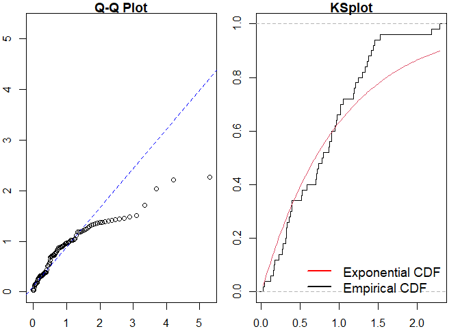

<!-- README.md is generated from README.Rmd. Please edit that file -->

# ppdiag

<!-- badges: start -->

[](https://github.com/OwenWard/ppdiag/actions)
[](https://www.tidyverse.org/lifecycle/#maturing)
[](https://codecov.io/gh/OwenWard/ppdiag?branch=master)
<!-- badges: end -->

`ppdiag` is an `R` package which provides a collection of tools which
can be used to assess the fit of temporal point processes to data.

These currently include:

-   Simulating data from a specified point process
-   Fitting a specified point process model to data
-   Evaluating the fit of a point process model to data using several
    diagnostic tools

# Installation

<!-- You can install the released version of ppdiag from [CRAN](https://CRAN.R-project.org) with: -->
<!-- ``` r -->
<!-- install.packages("ppdiag") -->
<!-- ``` -->

The in development version of this package is available from
[GitHub](https://github.com/OwenWard/ppdiag) with:

``` r
# install.packages("remotes")
remotes::install_github("OwenWard/ppdiag")
#> Downloading GitHub repo OwenWard/ppdiag@HEAD
#>          checking for file 'C:\Users\owenw\AppData\Local\Temp\RtmpSugSAF\remotes297c267950b7\OwenWard-ppdiag-0094bdd/DESCRIPTION' ...  v  checking for file 'C:\Users\owenw\AppData\Local\Temp\RtmpSugSAF\remotes297c267950b7\OwenWard-ppdiag-0094bdd/DESCRIPTION'
#>       -  preparing 'ppdiag': (2s)
#>    checking DESCRIPTION meta-information ...     checking DESCRIPTION meta-information ...   v  checking DESCRIPTION meta-information
#>       -  checking for LF line-endings in source and make files and shell scripts
#>       -  checking for empty or unneeded directories
#>       -  building 'ppdiag_0.0.0.9000.tar.gz'
#>      
#> 
#> Installing package into 'C:/Users/owenw/AppData/Local/Temp/RtmpCyw8V9/temp_libpath59b42388497c'
#> (as 'lib' is unspecified)
```

# Example

To illustrate some of the basic functionality of this package, we can
simulate data from a specified Hawkes process and examine our diagnostic
results when we fit a homogeneous Poisson process to this data.

``` r
library(ppdiag)

hp_obj <- pp_hp(lambda0 = 0.2, alpha = 0.35, beta = 0.8)
sim_hp <- pp_simulate(hp_obj, end = 200)
#> Simulating up to endtime. To simulate n events specify n.
sim_hp
#> $events
#>  [1]   5.892076  19.900304  24.308263  28.016121  30.969818  32.728937
#>  [7]  33.304313  33.715432  34.003434  35.738146  37.549501  37.617501
#> [13]  37.733014  40.089184  40.291582  40.483325  41.208347  42.258012
#> [19]  43.960319  49.802850  58.855007  60.658840  62.283313  63.494050
#> [25]  63.995357  65.302977  74.038002  74.069471  76.917322  80.654227
#> [31]  84.999836  88.699965  89.155406  90.325116  93.722943  95.369246
#> [37] 110.915330 111.231900 112.369431 113.042280 117.183581 121.150987
#> [43] 121.417394 122.243563 141.524174 142.364253 145.714537 145.878264
#> [49] 150.603899 153.779288 157.723947 158.144618 159.485545 161.888211
#> [55] 164.762445 165.684041 167.339375 170.226574 171.062752 172.168498
#> [61] 173.523455 176.506185 178.402998 178.460696 179.710968 180.325090
#> [67] 180.578790 180.617571 180.749583 180.826545 181.078154 181.513147
#> [73] 181.670738 182.295372 182.799331 187.165821 187.873588 196.421973
#> [79] 199.914959
#> 
#> $lambda.max
#> [1] 1.635611
```

We can readily evaluate the fit of a homogeneous Poisson process to this
data.

``` r
est_hpp <- fithpp(sim_hp$events)
est_hpp
#> $lambda
#> [1] 0.395168
#> 
#> $events
#>  [1]   5.892076  19.900304  24.308263  28.016121  30.969818  32.728937
#>  [7]  33.304313  33.715432  34.003434  35.738146  37.549501  37.617501
#> [13]  37.733014  40.089184  40.291582  40.483325  41.208347  42.258012
#> [19]  43.960319  49.802850  58.855007  60.658840  62.283313  63.494050
#> [25]  63.995357  65.302977  74.038002  74.069471  76.917322  80.654227
#> [31]  84.999836  88.699965  89.155406  90.325116  93.722943  95.369246
#> [37] 110.915330 111.231900 112.369431 113.042280 117.183581 121.150987
#> [43] 121.417394 122.243563 141.524174 142.364253 145.714537 145.878264
#> [49] 150.603899 153.779288 157.723947 158.144618 159.485545 161.888211
#> [55] 164.762445 165.684041 167.339375 170.226574 171.062752 172.168498
#> [61] 173.523455 176.506185 178.402998 178.460696 179.710968 180.325090
#> [67] 180.578790 180.617571 180.749583 180.826545 181.078154 181.513147
#> [73] 181.670738 182.295372 182.799331 187.165821 187.873588 196.421973
#> [79] 199.914959
#> 
#> attr(,"class")
#> [1] "pp_hpp"

pp_diag(est_hpp, events = sim_hp$events)
#> Please input the right model. Select from hp, hpp, mmpp and mmhp.
```

``` r
hp_est <- fithp(events = sim_hp$events)
pp_diag(hp_est, events = sim_hp$events)
#> Please input the right model. Select from hp, hpp, mmpp and mmhp.
```

## MMHP Example

This is particularly useful for more complex point processes, such as
the Markov Modulated Hawkes Process. We can simulate events from this
model and examine the fit of simpler point processes to this data.

``` r
Q <- matrix(c(-0.2, 0.2, 0.1, -0.1), ncol = 2, byrow = TRUE)

mmhp_obj <- pp_mmhp(Q, delta = c(1 / 3, 2 / 3), 
          lambda0 = 0.2,
          lambda1 = .75,
          alpha = 0.4,
          beta = 0.8)

mmhp_obj
#> $Q
#>      [,1] [,2]
#> [1,] -0.2  0.2
#> [2,]  0.1 -0.1
#> 
#> $delta
#> [1] 0.3333333 0.6666667
#> 
#> $events
#> NULL
#> 
#> $lambda0
#> [1] 0.2
#> 
#> $lambda1
#> [1] 0.75
#> 
#> $alpha
#> [1] 0.4
#> 
#> $beta
#> [1] 0.8
#> 
#> attr(,"class")
#> [1] "mmhp"
mmhp_events <- pp_simulate(mmhp_obj, n = 50)
#> 50 events simulated. To simulate up to endtime set given_states=TRUE and provide states.
```

We can easily fit a homogeneous Poisson process and visualise the
goodness of fit.

``` r
est_hpp <- fithpp(events = mmhp_events$events)
pp_diag(est_hpp,mmhp_events$events)
#> Please input the right model. Select from hp, hpp, mmpp and mmhp.
```

Similarly for a Hawkes process.

``` r
est_hp <- fithp(events = mmhp_events$events)
pp_diag(est_hp,mmhp_events$events)
#> Please input the right model. Select from hp, hpp, mmpp and mmhp.
```

We can then compare to the true point process model.

``` r
pp_diag(mmhp_obj,mmhp_events$events)
```



    #> Raw residual: 11.9952
    #> Pearson residual: 16.41573
    #> 
    #>  One-sample Kolmogorov-Smirnov test
    #> 
    #> data:  r
    #> D = 0.18486, p-value = 0.05729
    #> alternative hypothesis: two-sided

# Getting help and contributing

Please file any issues
[here](https://github.com/OwenWard/ppdiag/issues). Similarly, we would
be delighted if anyone would like to contribute to this package (such as
adding other point processes, kernel functions). Feel free to reach out.

# References

-   Wu et al., Diagnostics and Visualization of Point Process Models for
    Event Times on a Social Network, <https://arxiv.org/abs/2001.09359>
