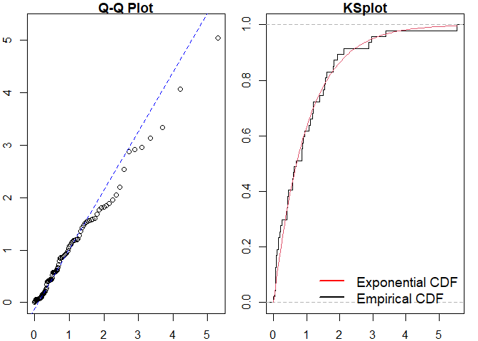
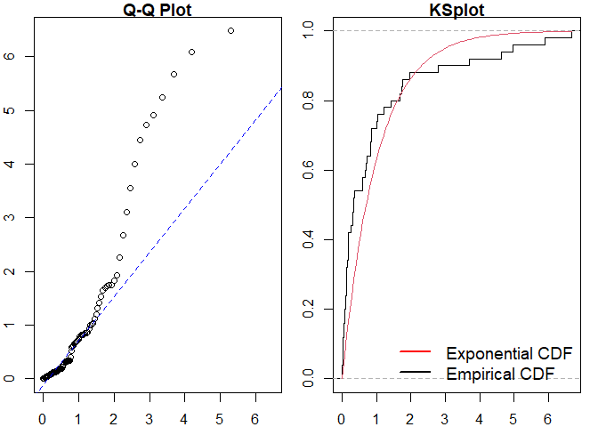
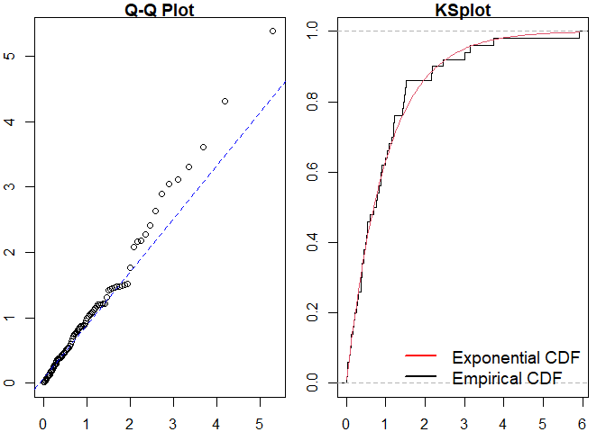

<!-- README.md is generated from README.Rmd. Please edit that file -->

# ppdiag

<!-- badges: start -->

[](https://github.com/OwenWard/ppdiag/actions)
[](https://lifecycle.r-lib.org/articles/stages.html)
[](https://codecov.io/gh/OwenWard/ppdiag?branch=main)
<!-- badges: end -->

`ppdiag` is an `R` package which provides a collection of tools which
can be used to assess the fit of temporal point processes to data.

These currently include:

-   Simulating data from a specified point process
-   Fitting a specified point process model to data
-   Evaluating the fit of a point process model to data using several
    diagnostic tools

# Installation

<!-- You can install the released version of ppdiag from [CRAN](https://CRAN.R-project.org) with: -->
<!-- ``` r -->
<!-- install.packages("ppdiag") -->
<!-- ``` -->

The current version of this package is available from
[GitHub](https://github.com/OwenWard/ppdiag) with:

``` r
# install.packages("remotes")
remotes::install_github("OwenWard/ppdiag")
```

# Example

To illustrate some of the basic functionality of this package, we can
simulate data from a specified Hawkes process and examine our diagnostic
results when we fit a homogeneous Poisson process to this data.

``` r
library(ppdiag)

hp_obj <- pp_hp(lambda0 = 0.2, alpha = 0.35, beta = 0.8)
sim_hp <- pp_simulate(hp_obj, end = 200)
#> Simulating up to endtime. To simulate n events specify n.
sim_hp
#>  [1]   2.428759  16.005675  16.308490  16.408200  18.987400  20.270474
#>  [7]  22.556867  22.858803  24.188950  25.002891  27.043751  28.563402
#> [13]  29.805195  30.458281  30.760871  41.972755  51.497275  52.166098
#> [19]  53.391351  54.720935  54.870996  55.432757  56.667481  56.678278
#> [25]  57.220260  57.294875  57.310421  57.775780  58.168267  58.387811
#> [31]  58.868055  58.985685  59.886247  60.327138  63.773392  66.096720
#> [37]  66.960006  67.052091  68.365136  72.378336  72.792232  72.844427
#> [43]  75.355057  77.253591  79.264312  82.764235  99.955429 100.724704
#> [49] 101.692781 101.794256 102.246983 102.363867 102.485557 105.459126
#> [55] 105.581747 106.766589 113.837046 114.127011 117.073844 122.043846
#> [61] 122.455267 123.346598 123.718883 123.997539 124.544602 125.246600
#> [67] 136.082805 136.262293 136.775987 136.944105 137.388449 138.313089
#> [73] 138.377310 144.832626 148.809369 152.269764 153.481054 153.622839
#> [79] 153.974096 154.263938 154.530243 154.812371 156.522268 156.752469
#> [85] 156.870297 157.726924 174.513375 178.899948 188.875837 189.974723
#> [91] 192.550456 195.804655
```

We can readily evaluate the fit of a homogeneous Poisson process to this
data.

``` r
est_hpp <- fithpp(sim_hp)
est_hpp
#> $lambda
#> [1] 0.469856
#> 
#> $events
#>  [1]   2.428759  16.005675  16.308490  16.408200  18.987400  20.270474
#>  [7]  22.556867  22.858803  24.188950  25.002891  27.043751  28.563402
#> [13]  29.805195  30.458281  30.760871  41.972755  51.497275  52.166098
#> [19]  53.391351  54.720935  54.870996  55.432757  56.667481  56.678278
#> [25]  57.220260  57.294875  57.310421  57.775780  58.168267  58.387811
#> [31]  58.868055  58.985685  59.886247  60.327138  63.773392  66.096720
#> [37]  66.960006  67.052091  68.365136  72.378336  72.792232  72.844427
#> [43]  75.355057  77.253591  79.264312  82.764235  99.955429 100.724704
#> [49] 101.692781 101.794256 102.246983 102.363867 102.485557 105.459126
#> [55] 105.581747 106.766589 113.837046 114.127011 117.073844 122.043846
#> [61] 122.455267 123.346598 123.718883 123.997539 124.544602 125.246600
#> [67] 136.082805 136.262293 136.775987 136.944105 137.388449 138.313089
#> [73] 138.377310 144.832626 148.809369 152.269764 153.481054 153.622839
#> [79] 153.974096 154.263938 154.530243 154.812371 156.522268 156.752469
#> [85] 156.870297 157.726924 174.513375 178.899948 188.875837 189.974723
#> [91] 192.550456 195.804655
#> 
#> attr(,"class")
#> [1] "hpp"

pp_diag(est_hpp, events = sim_hp)
```



    #> 
    #> Raw residual: 0
    #> Pearson residual: 0
    #> 
    #>  One-sample Kolmogorov-Smirnov test
    #> 
    #> data:  r
    #> D = 0.21367, p-value = 0.0003642
    #> alternative hypothesis: two-sided

``` r
hp_est <- fithp(events = sim_hp)
pp_diag(hp_est, events = sim_hp)
```


    #> Raw residual: 0.005322674
    #> Pearson residual: 0.3713325
    #> 
    #>  One-sample Kolmogorov-Smirnov test
    #> 
    #> data:  r
    #> D = 0.047082, p-value = 0.9811
    #> alternative hypothesis: two-sided

## MMHP Example

This is particularly useful for more complex point processes, such as
the Markov Modulated Hawkes Process. We can simulate events from this
model and examine the fit of simpler point processes to this data.

``` r
Q <- matrix(c(-0.2, 0.2, 0.1, -0.1), ncol = 2, byrow = TRUE)

mmhp_obj <- pp_mmhp(Q, delta = c(1 / 3, 2 / 3), 
          lambda0 = 0.2,
          lambda1 = .75,
          alpha = 0.4,
          beta = 0.8)

mmhp_obj
#> $Q
#>      [,1] [,2]
#> [1,] -0.2  0.2
#> [2,]  0.1 -0.1
#> 
#> $delta
#> [1] 0.3333333 0.6666667
#> 
#> $events
#> NULL
#> 
#> $lambda0
#> [1] 0.2
#> 
#> $lambda1
#> [1] 0.75
#> 
#> $alpha
#> [1] 0.4
#> 
#> $beta
#> [1] 0.8
#> 
#> attr(,"class")
#> [1] "mmhp"
mmhp_events <- pp_simulate(mmhp_obj, n = 50)
```

We can easily fit a homogeneous Poisson process and visualise the
goodness of fit.

``` r
est_hpp <- fithpp(events = mmhp_events$events)
pp_diag(est_hpp,mmhp_events$events)
```



    #> 
    #> Raw residual: -1
    #> Pearson residual: -1.522031
    #> 
    #>  One-sample Kolmogorov-Smirnov test
    #> 
    #> data:  r
    #> D = 0.24763, p-value = 0.003465
    #> alternative hypothesis: two-sided

Similarly for a Hawkes process.

``` r
est_hp <- fithp(events = mmhp_events$events)
pp_diag(est_hp,mmhp_events$events)
```



    #> Raw residual: -0.5265239
    #> Pearson residual: -1.839195
    #> 
    #>  One-sample Kolmogorov-Smirnov test
    #> 
    #> data:  r
    #> D = 0.078473, p-value = 0.894
    #> alternative hypothesis: two-sided

We can then compare to the true point process model.

``` r
pp_diag(mmhp_obj, mmhp_events$events)
```


    #> Raw residual: 9.603473
    #> Pearson residual: 8.330262
    #> 
    #>  One-sample Kolmogorov-Smirnov test
    #> 
    #> data:  r
    #> D = 0.08719, p-value = 0.81
    #> alternative hypothesis: two-sided

# Getting help and contributing

Please file any issues
[here](https://github.com/OwenWard/ppdiag/issues). Similarly, we would
be delighted if anyone would like to contribute to this package (such as
adding other point processes, kernel functions). Feel free to reach out.

# References

-   Wu et al., Diagnostics and Visualization of Point Process Models for
    Event Times on a Social Network, <https://arxiv.org/abs/2001.09359>
