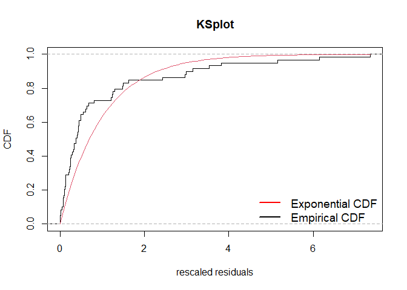

<!-- README.md is generated from README.Rmd. Please edit that file -->

# ppdiag

<!-- badges: start -->

[](https://github.com/OwenWard/ppdiag/actions)
[](https://www.tidyverse.org/lifecycle/#maturing)
[](https://codecov.io/gh/OwenWard/ppdiag?branch=master)
<!-- badges: end -->

`ppdiag` is an `R` package which provides a collection of tools which
can be used to assess the fit of temporal point processes to data.

These currently include:

  - Simulating data from a specified point process
  - Fitting a specified point process model to data
  - Evaluating the fit of a point process model to data using several
    diagnostic tools

## Installation

<!-- You can install the released version of ppdiag from [CRAN](https://CRAN.R-project.org) with: -->

<!-- ``` r -->

<!-- install.packages("ppdiag") -->

<!-- ``` -->

The in development version of this package is available from
[GitHub](https://github.com/OwenWard/ppdiag) with:

``` r
# install.packages("devtools")
devtools::install_github("OwenWard/ppdiag")
```

## Example

To illustrate some of the basic functionality of this package, we can
simulate data from a specified Hawkes process and examine our diagnostic
results when we fit a homogeneous Poisson process to this data.

``` r
library(ppdiag)

hp_obj <- hp(lambda0 = 0.2, alpha = 0.35, beta = 0.8)
sim_hp <- simulatehp(hp_obj, end = 200)
#> Simulating up to endtime. To simulate n events specify n.
sim_hp
#> $events
#>  [1]   2.723114   2.993199   3.963697   4.062089   4.733162   5.771615
#>  [7]   5.801569   6.737178   7.324133   7.580205   7.927028   8.318965
#> [13]   8.594809   8.700487   8.930449  11.034292  19.594631  23.587682
#> [19]  24.249187  24.502221  24.730912  24.830784  25.455628  25.624256
#> [25]  26.174545  27.384280  28.274065  35.660567  36.194102  37.395211
#> [31]  50.831025  54.803144  55.540575  56.597133  57.734444  58.257178
#> [37]  61.436918  62.139664  63.006682  79.273183  90.417723  91.214349
#> [43]  93.394879  93.619564  95.868741  97.359707  99.655887 109.004057
#> [49] 112.206048 112.634570 115.240553 115.434911 116.823687 116.900862
#> [55] 116.945534 117.173174 117.347027 117.546846 118.774701 119.024396
#> [61] 119.580934 119.623597 120.010155 120.833438 120.933445 120.937347
#> [67] 121.490504 121.521778 141.603114 144.167430 148.089370 157.012320
#> [73] 159.289656 161.772975 164.250479 164.696688 165.156135 165.440139
#> [79] 165.679162 166.099657 168.119607 173.508999 183.401147 184.252067
#> [85] 185.185439 189.379031 189.582998 195.823527
#> 
#> $lambda.max
#> [1] 1.59166
```

We can readily evaluate the fit of a homogeneous Poisson process to this
data.

``` r
est_hpp <- fithpp(sim_hp$events)
est_hpp
#> $lambda
#> [1] 0.4557214
#> 
#> $events
#>  [1]   2.723114   2.993199   3.963697   4.062089   4.733162   5.771615
#>  [7]   5.801569   6.737178   7.324133   7.580205   7.927028   8.318965
#> [13]   8.594809   8.700487   8.930449  11.034292  19.594631  23.587682
#> [19]  24.249187  24.502221  24.730912  24.830784  25.455628  25.624256
#> [25]  26.174545  27.384280  28.274065  35.660567  36.194102  37.395211
#> [31]  50.831025  54.803144  55.540575  56.597133  57.734444  58.257178
#> [37]  61.436918  62.139664  63.006682  79.273183  90.417723  91.214349
#> [43]  93.394879  93.619564  95.868741  97.359707  99.655887 109.004057
#> [49] 112.206048 112.634570 115.240553 115.434911 116.823687 116.900862
#> [55] 116.945534 117.173174 117.347027 117.546846 118.774701 119.024396
#> [61] 119.580934 119.623597 120.010155 120.833438 120.933445 120.937347
#> [67] 121.490504 121.521778 141.603114 144.167430 148.089370 157.012320
#> [73] 159.289656 161.772975 164.250479 164.696688 165.156135 165.440139
#> [79] 165.679162 166.099657 168.119607 173.508999 183.401147 184.252067
#> [85] 185.185439 189.379031 189.582998 195.823527
#> 
#> attr(,"class")
#> [1] "hpp"

diagpp(est_hpp, events = sim_hp$events)
```



    #> 
    #> Raw residual: 88
    #> Pearson residual: -1.838296
    #> 
    #>  One-sample Kolmogorov-Smirnov test
    #> 
    #> data:  r
    #> D = 0.24484, p-value = 3.941e-05
    #> alternative hypothesis: two-sided

``` r
hp_est <- fithp(events = sim_hp$events)
diagpp(hp_est, events = sim_hp$events)
```


    #> Raw residual: -0.0002747434
    #> Pearson residual: 1.001754
    #> 
    #>  One-sample Kolmogorov-Smirnov test
    #> 
    #> data:  r
    #> D = 0.06227, p-value = 0.8633
    #> alternative hypothesis: two-sided

## MMHP Example

This is particularly useful for more complex point processes, such as
the Markov Modulated Hawkes Process. We can simulate events from this
model and examine the fit of simpler point processes to this data.

``` r
Q <- matrix(c(-0.2, 0.2, 0.1, -0.1), ncol = 2, byrow = TRUE)

mmhp_obj <- mmhp(Q, delta = c(1 / 3, 2 / 3), 
          lambda0 = 0.2,
          lambda1 = .75,
          alpha = 0.4,
          beta = 0.8)

mmhp_obj
#> $Q
#>      [,1] [,2]
#> [1,] -0.2  0.2
#> [2,]  0.1 -0.1
#> 
#> $delta
#> [1] 0.3333333 0.6666667
#> 
#> $events
#> NULL
#> 
#> $lambda0
#> [1] 0.2
#> 
#> $lambda1
#> [1] 0.75
#> 
#> $alpha
#> [1] 0.4
#> 
#> $beta
#> [1] 0.8
#> 
#> attr(,"class")
#> [1] "mmhp"
mmhp_events <- simulatemmhp(mmhp_obj, n = 50)
#> 50 events simulated. To simulate up to endtime set given_states=TRUE and provide states.
```

We can easily fit a homogeneous Poisson process and visualise the
goodness of fit.

``` r
est_hpp <- fithpp(events = mmhp_events$events)
diagpp(est_hpp,mmhp_events$events)
```


    #> 
    #> Raw residual: 51
    #> Pearson residual: 0
    #> 
    #>  One-sample Kolmogorov-Smirnov test
    #> 
    #> data:  r
    #> D = 0.24383, p-value = 0.004205
    #> alternative hypothesis: two-sided

Similarly for a Hawkes process.

``` r
est_hp <- fithp(events = mmhp_events$events)
diagpp(est_hp,mmhp_events$events)
```


    #> Raw residual: -9.295726e-05
    #> Pearson residual: 0.2062409
    #> 
    #>  One-sample Kolmogorov-Smirnov test
    #> 
    #> data:  r
    #> D = 0.074583, p-value = 0.9242
    #> alternative hypothesis: two-sided

We can then compare to the true point process model.

``` r
diagpp(mmhp_obj,mmhp_events$events)
```


    #> Raw residual: 9.358327
    #> Pearson residual: 13.55225
    #> 
    #>  One-sample Kolmogorov-Smirnov test
    #> 
    #> data:  r
    #> D = 0.077116, p-value = 0.9051
    #> alternative hypothesis: two-sided
