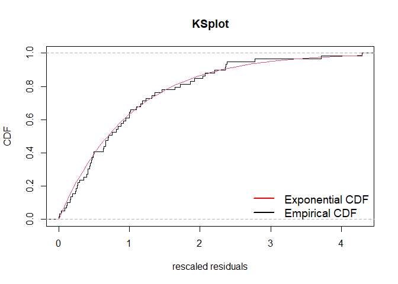
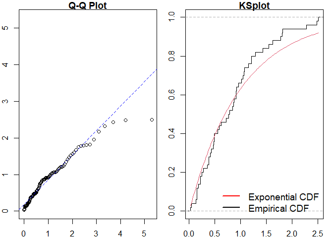

<!-- README.md is generated from README.Rmd. Please edit that file -->

# ppdiag

<!-- badges: start -->

[](https://github.com/OwenWard/ppdiag/actions)
[](https://www.tidyverse.org/lifecycle/#maturing)
[](https://codecov.io/gh/OwenWard/ppdiag?branch=master)
<!-- badges: end -->

`ppdiag` is an `R` package which provides a collection of tools which
can be used to assess the fit of temporal point processes to data.

These currently include:

  - Simulating data from a specified point process
  - Fitting a specified point process model to data
  - Evaluating the fit of a point process model to data using several
    diagnostic tools

## Installation

<!-- You can install the released version of ppdiag from [CRAN](https://CRAN.R-project.org) with: -->

<!-- ``` r -->

<!-- install.packages("ppdiag") -->

<!-- ``` -->

The in development version of this package is available from
[GitHub](https://github.com/OwenWard/ppdiag) with:

``` r
# install.packages("devtools")
devtools::install_github("OwenWard/ppdiag")
```

## Example

To illustrate some of the basic functionality of this package, we can
simulate data from a specified Hawkes process and examine our diagnostic
results when we fit a homogeneous Poisson process to this data.

``` r
library(ppdiag)

hp_obj <- hp(lambda0 = 0.2, alpha = 0.35, beta = 0.8)
sim_hp <- simulatehp(hp_obj, end = 200)
#> Simulating up to endtime. To simulate n events specify n.
sim_hp
#> $events
#>  [1]   8.761899  21.036980  21.991337  23.391633  24.177857  24.511210
#>  [7]  25.702796  25.937654  27.373773  31.520000  31.877112  34.467070
#> [13]  38.461086  39.522600  39.964184  47.776783  49.943636  59.448151
#> [19]  83.012201  99.536252 100.307178 100.372424 100.652395 101.729779
#> [25] 121.426380 123.377771 128.142991 137.725687 138.118089 138.932666
#> [31] 140.695602 145.911693 145.942575 147.400560 148.619123 150.197754
#> [37] 152.238040 153.583899 157.581572 157.814416 157.815367 158.223065
#> [43] 158.466506 159.474204 159.917234 160.623121 160.698534 162.257757
#> [49] 162.703395 163.348421 164.191265 168.991314 179.069977 180.477806
#> [55] 191.810877 195.686487 196.995866 197.788781 197.951924
#> 
#> $lambda.max
#> [1] 1.086243
```

We can readily evaluate the fit of a homogeneous Poisson process to this
data.

``` r
est_hpp <- fithpp(sim_hp$events)
est_hpp
#> $lambda
#> [1] 0.3118558
#> 
#> $events
#>  [1]   8.761899  21.036980  21.991337  23.391633  24.177857  24.511210
#>  [7]  25.702796  25.937654  27.373773  31.520000  31.877112  34.467070
#> [13]  38.461086  39.522600  39.964184  47.776783  49.943636  59.448151
#> [19]  83.012201  99.536252 100.307178 100.372424 100.652395 101.729779
#> [25] 121.426380 123.377771 128.142991 137.725687 138.118089 138.932666
#> [31] 140.695602 145.911693 145.942575 147.400560 148.619123 150.197754
#> [37] 152.238040 153.583899 157.581572 157.814416 157.815367 158.223065
#> [43] 158.466506 159.474204 159.917234 160.623121 160.698534 162.257757
#> [49] 162.703395 163.348421 164.191265 168.991314 179.069977 180.477806
#> [55] 191.810877 195.686487 196.995866 197.788781 197.951924
#> 
#> attr(,"class")
#> [1] "hpp"

diagpp(est_hpp, events = sim_hp$events)
```


    #> 
    #> Raw residual: 59
    #> Pearson residual: -4.892999
    #> 
    #>  One-sample Kolmogorov-Smirnov test
    #> 
    #> data:  r
    #> D = 0.25528, p-value = 0.0007062
    #> alternative hypothesis: two-sided

``` r
hp_est <- fithp(events = sim_hp$events)
diagpp(hp_est, events = sim_hp$events)
```



    #> Raw residual: -0.0003818003
    #> Pearson residual: 3.40775
    #> 
    #>  One-sample Kolmogorov-Smirnov test
    #> 
    #> data:  r
    #> D = 0.072544, p-value = 0.8931
    #> alternative hypothesis: two-sided

## MMHP Example

This is particularly useful for more complex point processes, such as
the Markov Modulated Hawkes Process. We can simulate events from this
model and examine the fit of simpler point processes to this data.

``` r
Q <- matrix(c(-0.2, 0.2, 0.1, -0.1), ncol = 2, byrow = TRUE)

mmhp_obj <- mmhp(Q, delta = c(1 / 3, 2 / 3), 
          lambda0 = 0.2,
          lambda1 = .75,
          alpha = 0.4,
          beta = 0.8)

mmhp_obj
#> $Q
#>      [,1] [,2]
#> [1,] -0.2  0.2
#> [2,]  0.1 -0.1
#> 
#> $delta
#> [1] 0.3333333 0.6666667
#> 
#> $events
#> NULL
#> 
#> $lambda0
#> [1] 0.2
#> 
#> $lambda1
#> [1] 0.75
#> 
#> $alpha
#> [1] 0.4
#> 
#> $beta
#> [1] 0.8
#> 
#> attr(,"class")
#> [1] "mmhp"
mmhp_events <- simulatemmhp(mmhp_obj, n = 50)
#> 50 events simulated. To simulate up to endtime set given_states=TRUE and provide states.
```

We can easily fit a homogeneous Poisson process and visualise the
goodness of fit.

``` r
est_hpp <- fithpp(events = mmhp_events$events)
diagpp(est_hpp,mmhp_events$events)
```


    #> 
    #> Raw residual: 51
    #> Pearson residual: 0
    #> 
    #>  One-sample Kolmogorov-Smirnov test
    #> 
    #> data:  r
    #> D = 0.096536, p-value = 0.7036
    #> alternative hypothesis: two-sided

Similarly for a Hawkes process.

``` r
est_hp <- fithp(events = mmhp_events$events)
diagpp(est_hp,mmhp_events$events)
```


    #> Raw residual: -8.216385e-05
    #> Pearson residual: 0.01676284
    #> 
    #>  One-sample Kolmogorov-Smirnov test
    #> 
    #> data:  r
    #> D = 0.094115, p-value = 0.7321
    #> alternative hypothesis: two-sided

We can then compare to the true point process model.

``` r
diagpp(mmhp_obj,mmhp_events$events)
```



    #> Raw residual: 12.40562
    #> Pearson residual: 25.07594
    #> 
    #>  One-sample Kolmogorov-Smirnov test
    #> 
    #> data:  r
    #> D = 0.17066, p-value = 0.09633
    #> alternative hypothesis: two-sided
