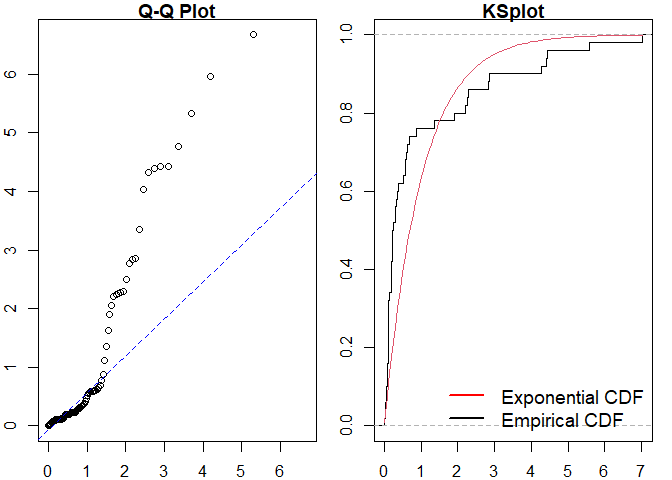

<!-- README.md is generated from README.Rmd. Please edit that file -->

# ppdiag

<!-- badges: start -->

[](https://github.com/OwenWard/ppdiag/actions)
[](https://CRAN.R-project.org/package=ppdiag)
[](https://lifecycle.r-lib.org/articles/stages.html)
[](https://codecov.io/gh/OwenWard/ppdiag?branch=main)
[](CODE_OF_CONDUCT.md)
<!-- badges: end -->

`ppdiag` is an `R` package which provides a collection of tools which
can be used to assess the fit of temporal point processes to data.

These currently include:

-   Simulating data from a specified point process
-   Fitting a specified point process model to data
-   Evaluating the fit of a point process model to data using several
    diagnostic tools

# Installation

You can install the released version of ppdiag from
[CRAN](https://CRAN.R-project.org) with:

``` r
install.packages("ppdiag")
```

The current development version of this package is available from
[GitHub](https://github.com/OwenWard/ppdiag) with:

``` r
# install.packages("remotes")
remotes::install_github("OwenWard/ppdiag")
```

# Example

To illustrate some of the basic functionality of this package, we can
simulate data from a specified Hawkes process and examine our diagnostic
results when we fit a homogeneous Poisson process to this data.

``` r
library(ppdiag)

hp_obj <- pp_hp(lambda0 = 0.2, alpha = 0.35, beta = 0.8)
sim_hp <- pp_simulate(hp_obj, end = 200)
sim_hp
#>  [1]   0.9028774   2.1440211  12.5023753  13.1117594  15.2125103  16.4468785
#>  [7]  22.0673950  28.0077200  28.7309437  28.8399044  29.8898289  31.2596296
#> [13]  32.9789068  33.0952675  47.3363303  47.4550222  52.2806143  52.7807790
#> [19]  53.8471582  70.6502357  71.2346665  71.9704604  74.2900289  77.9300598
#> [25]  86.2557153  86.9531752  92.3820592 102.7484174 103.2037018 103.2931602
#> [31] 103.6600985 106.2132004 110.6646722 114.5946863 116.0299836 116.1304621
#> [37] 116.2030573 116.2219153 116.5640912 116.5834268 116.7923988 117.1433428
#> [43] 117.3212496 118.2355304 122.7278904 123.5293785 123.9301859 126.7675328
#> [49] 136.4601124 162.4423253 162.5968625 162.9340964 165.1812875 176.5825227
#> [55] 180.7287522 185.5611023 185.7220408 186.5938809 190.1311457 192.9218856
#> [61] 193.2152954 196.3592700
```

We can readily evaluate the fit of a homogeneous Poisson process to this
data.

``` r
est_hpp <- fithpp(sim_hp)
est_hpp
#> $lambda
#> [1] 0.3157478
#> 
#> $events
#>  [1]   0.9028774   2.1440211  12.5023753  13.1117594  15.2125103  16.4468785
#>  [7]  22.0673950  28.0077200  28.7309437  28.8399044  29.8898289  31.2596296
#> [13]  32.9789068  33.0952675  47.3363303  47.4550222  52.2806143  52.7807790
#> [19]  53.8471582  70.6502357  71.2346665  71.9704604  74.2900289  77.9300598
#> [25]  86.2557153  86.9531752  92.3820592 102.7484174 103.2037018 103.2931602
#> [31] 103.6600985 106.2132004 110.6646722 114.5946863 116.0299836 116.1304621
#> [37] 116.2030573 116.2219153 116.5640912 116.5834268 116.7923988 117.1433428
#> [43] 117.3212496 118.2355304 122.7278904 123.5293785 123.9301859 126.7675328
#> [49] 136.4601124 162.4423253 162.5968625 162.9340964 165.1812875 176.5825227
#> [55] 180.7287522 185.5611023 185.7220408 186.5938809 190.1311457 192.9218856
#> [61] 193.2152954 196.3592700
#> 
#> attr(,"class")
#> [1] "hpp"

pp_diag(est_hpp, events = sim_hp)
```


    #> 
    #> Raw residual: 0
    #> Pearson residual: -1.421085e-14
    #> 
    #>  One-sample Kolmogorov-Smirnov test
    #> 
    #> data:  r
    #> D = 0.21699, p-value = 0.004829
    #> alternative hypothesis: two-sided

``` r
hp_est <- fithp(events = sim_hp)
pp_diag(hp_est, events = sim_hp)
```


    #> Raw residual: -0.004365144
    #> Pearson residual: -0.2098432
    #> 
    #>  One-sample Kolmogorov-Smirnov test
    #> 
    #> data:  r
    #> D = 0.064756, p-value = 0.9422
    #> alternative hypothesis: two-sided

## Markov Modulated Hawkes Process Example

This is particularly useful for more complex point processes, such as
the Markov Modulated Hawkes Process (MMHP). We can simulate events from
this model and examine the fit of simpler point processes to this data.

``` r
Q <- matrix(c(-0.2, 0.2, 0.1, -0.1), ncol = 2, byrow = TRUE)

mmhp_obj <- pp_mmhp(Q, delta = c(1 / 3, 2 / 3), 
          lambda0 = 0.2,
          lambda1 = .75,
          alpha = 0.4,
          beta = 0.8)

mmhp_obj
#> $Q
#>      [,1] [,2]
#> [1,] -0.2  0.2
#> [2,]  0.1 -0.1
#> 
#> $delta
#> [1] 0.3333333 0.6666667
#> 
#> $events
#> NULL
#> 
#> $lambda0
#> [1] 0.2
#> 
#> $lambda1
#> [1] 0.75
#> 
#> $alpha
#> [1] 0.4
#> 
#> $beta
#> [1] 0.8
#> 
#> attr(,"class")
#> [1] "mmhp"
mmhp_events <- pp_simulate(mmhp_obj, n = 50)
```

We can easily fit a homogeneous Poisson process and visualise the
goodness of fit.

``` r
est_hpp <- fithpp(events = mmhp_events$events)
pp_diag(est_hpp,mmhp_events$events)
```



    #> 
    #> Raw residual: -1
    #> Pearson residual: -1.450621
    #> 
    #>  One-sample Kolmogorov-Smirnov test
    #> 
    #> data:  r
    #> D = 0.206, p-value = 0.02446
    #> alternative hypothesis: two-sided

Similarly for a Hawkes process.

``` r
est_hp <- fithp(events = mmhp_events$events)
pp_diag(est_hp,mmhp_events$events)
```


    #> Raw residual: -0.6342256
    #> Pearson residual: -1.830059
    #> 
    #>  One-sample Kolmogorov-Smirnov test
    #> 
    #> data:  r
    #> D = 0.093848, p-value = 0.7352
    #> alternative hypothesis: two-sided

We can then compare to the true point process model.

``` r
pp_diag(mmhp_obj, mmhp_events$events)
```


    #> Raw residual: 13.07489
    #> Pearson residual: 21.01997
    #> 
    #>  One-sample Kolmogorov-Smirnov test
    #> 
    #> data:  r
    #> D = 0.17639, p-value = 0.07852
    #> alternative hypothesis: two-sided

# Getting help and contributing

Please file any issues
[here](https://github.com/OwenWard/ppdiag/issues). Similarly, we would
be delighted if anyone would like to contribute to this package (such as
adding other point processes, kernel functions). Feel free to reach out.

# References

-   Wu et al., Diagnostics and Visualization of Point Process Models for
    Event Times on a Social Network, <https://arxiv.org/abs/2001.09359>
