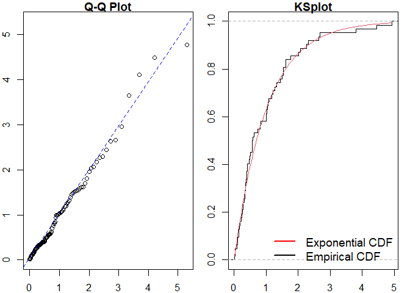

<!-- README.md is generated from README.Rmd. Please edit that file -->

# ppdiag

<!-- badges: start -->

[](https://github.com/OwenWard/ppdiag/actions)
[](https://CRAN.R-project.org/package=ppdiag)
[](https://lifecycle.r-lib.org/articles/stages.html)
[](https://codecov.io/gh/OwenWard/ppdiag?branch=main)
<!-- badges: end -->

`ppdiag` is an `R` package which provides a collection of tools which
can be used to assess the fit of temporal point processes to data.

These currently include:

-   Simulating data from a specified point process
-   Fitting a specified point process model to data
-   Evaluating the fit of a point process model to data using several
    diagnostic tools

# Installation

You can install the released version of ppdiag from
[CRAN](https://CRAN.R-project.org) with:

``` r
install.packages("ppdiag")
```

The current development version of this package is available from
[GitHub](https://github.com/OwenWard/ppdiag) with:

``` r
# install.packages("remotes")
remotes::install_github("OwenWard/ppdiag")
```

# Example

To illustrate some of the basic functionality of this package, we can
simulate data from a specified Hawkes process and examine our diagnostic
results when we fit a homogeneous Poisson process to this data.

``` r
library(ppdiag)

hp_obj <- pp_hp(lambda0 = 0.2, alpha = 0.35, beta = 0.8)
sim_hp <- pp_simulate(hp_obj, end = 200)
sim_hp
#>  [1]   7.581703   7.998168   8.614021   8.941138  10.648613  15.364071
#>  [7]  17.800640  25.491057  28.127978  32.123344  36.650980  40.393909
#> [13]  46.739837  47.395302  50.294564  62.837118  65.235044  66.340397
#> [19]  71.383948  77.309497  91.678156  91.905564  95.553557 102.090414
#> [25] 108.745371 120.906119 122.660710 123.562649 126.055677 149.457071
#> [31] 156.214770 156.991597 162.095315 162.099438 167.096198 167.398154
#> [37] 171.239529 174.824605 174.964051 175.205379 175.454114 175.808449
#> [43] 177.648504 179.547997 187.674615 196.690195 198.482319
```

We can readily evaluate the fit of a homogeneous Poisson process to this
data.

``` r
est_hpp <- fithpp(sim_hp)
est_hpp
#> $lambda
#> [1] 0.2367969
#> 
#> $events
#>  [1]   7.581703   7.998168   8.614021   8.941138  10.648613  15.364071
#>  [7]  17.800640  25.491057  28.127978  32.123344  36.650980  40.393909
#> [13]  46.739837  47.395302  50.294564  62.837118  65.235044  66.340397
#> [19]  71.383948  77.309497  91.678156  91.905564  95.553557 102.090414
#> [25] 108.745371 120.906119 122.660710 123.562649 126.055677 149.457071
#> [31] 156.214770 156.991597 162.095315 162.099438 167.096198 167.398154
#> [37] 171.239529 174.824605 174.964051 175.205379 175.454114 175.808449
#> [43] 177.648504 179.547997 187.674615 196.690195 198.482319
#> 
#> attr(,"class")
#> [1] "hpp"

pp_diag(est_hpp, events = sim_hp)
```


    #> 
    #> Raw residual: 0
    #> Pearson residual: 1.421085e-14
    #> 
    #>  One-sample Kolmogorov-Smirnov test
    #> 
    #> data:  r
    #> D = 0.097578, p-value = 0.7253
    #> alternative hypothesis: two-sided

``` r
hp_est <- fithp(events = sim_hp)
pp_diag(hp_est, events = sim_hp)
```



    #> Raw residual: -0.008636336
    #> Pearson residual: -0.07027012
    #> 
    #>  One-sample Kolmogorov-Smirnov test
    #> 
    #> data:  r
    #> D = 0.086768, p-value = 0.8409
    #> alternative hypothesis: two-sided

## MMHP Example

This is particularly useful for more complex point processes, such as
the Markov Modulated Hawkes Process. We can simulate events from this
model and examine the fit of simpler point processes to this data.

``` r
Q <- matrix(c(-0.2, 0.2, 0.1, -0.1), ncol = 2, byrow = TRUE)

mmhp_obj <- pp_mmhp(Q, delta = c(1 / 3, 2 / 3), 
          lambda0 = 0.2,
          lambda1 = .75,
          alpha = 0.4,
          beta = 0.8)

mmhp_obj
#> $Q
#>      [,1] [,2]
#> [1,] -0.2  0.2
#> [2,]  0.1 -0.1
#> 
#> $delta
#> [1] 0.3333333 0.6666667
#> 
#> $events
#> NULL
#> 
#> $lambda0
#> [1] 0.2
#> 
#> $lambda1
#> [1] 0.75
#> 
#> $alpha
#> [1] 0.4
#> 
#> $beta
#> [1] 0.8
#> 
#> attr(,"class")
#> [1] "mmhp"
mmhp_events <- pp_simulate(mmhp_obj, n = 50)
```

We can easily fit a homogeneous Poisson process and visualise the
goodness of fit.

``` r
est_hpp <- fithpp(events = mmhp_events$events)
pp_diag(est_hpp,mmhp_events$events)
```


    #> 
    #> Raw residual: -1
    #> Pearson residual: -1.653811
    #> 
    #>  One-sample Kolmogorov-Smirnov test
    #> 
    #> data:  r
    #> D = 0.21174, p-value = 0.01909
    #> alternative hypothesis: two-sided

Similarly for a Hawkes process.

``` r
est_hp <- fithp(events = mmhp_events$events)
pp_diag(est_hp,mmhp_events$events)
```


    #> Raw residual: -0.4721489
    #> Pearson residual: -1.887457
    #> 
    #>  One-sample Kolmogorov-Smirnov test
    #> 
    #> data:  r
    #> D = 0.083692, p-value = 0.8461
    #> alternative hypothesis: two-sided

We can then compare to the true point process model.

``` r
pp_diag(mmhp_obj, mmhp_events$events)
```


    #> Raw residual: 6.08402
    #> Pearson residual: 7.619131
    #> 
    #>  One-sample Kolmogorov-Smirnov test
    #> 
    #> data:  r
    #> D = 0.11113, p-value = 0.5309
    #> alternative hypothesis: two-sided

# Getting help and contributing

Please file any issues
[here](https://github.com/OwenWard/ppdiag/issues). Similarly, we would
be delighted if anyone would like to contribute to this package (such as
adding other point processes, kernel functions). Feel free to reach out.

# References

-   Wu et al., Diagnostics and Visualization of Point Process Models for
    Event Times on a Social Network, <https://arxiv.org/abs/2001.09359>
