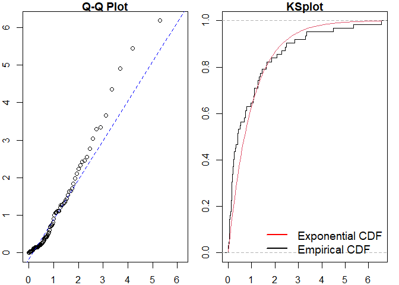

<!-- README.md is generated from README.Rmd. Please edit that file -->

# ppdiag

<!-- badges: start -->

[](https://github.com/OwenWard/ppdiag/actions)
[](https://CRAN.R-project.org/package=ppdiag)
[](https://lifecycle.r-lib.org/articles/stages.html)
[](https://codecov.io/gh/OwenWard/ppdiag?branch=main)
[](https://doi.org/10.21105/joss.03133)
<!-- badges: end -->

`ppdiag` is an `R` package which provides a collection of tools which
can be used to assess the fit of temporal point processes to data.

These currently include:

-   Simulating data from a specified point process
-   Fitting a specified point process model to data
-   Evaluating the fit of a point process model to data using several
    diagnostic tools

# Installation

You can install the released version of ppdiag from
[CRAN](https://CRAN.R-project.org) with:

``` r
install.packages("ppdiag")
```

The current development version of this package is available from
[GitHub](https://github.com/OwenWard/ppdiag) with:

``` r
# install.packages("remotes")
remotes::install_github("OwenWard/ppdiag")
```

# Example

To illustrate some of the basic functionality of this package, we can
simulate data from a specified Hawkes process and examine our diagnostic
results when we fit a homogeneous Poisson process to this data.

``` r
library(ppdiag)

hp_obj <- pp_hp(lambda0 = 0.2, alpha = 0.35, beta = 0.8)
sim_hp <- pp_simulate(hp_obj, end = 200)
sim_hp
#>  [1]   2.186230   3.565304   3.902349   3.964491   6.925180   7.550459
#>  [7]  11.661489  13.546240  14.708947  18.504127  21.884172  28.200651
#> [13]  32.725824  32.948553  34.321960  34.336526  35.798993  42.058508
#> [19]  49.942025  54.593947  63.020692  63.910373  64.643690  65.032153
#> [25]  65.657198  75.292857  76.692171  79.951074  81.007021  88.885178
#> [31]  90.571610 109.024238 109.833981 111.815871 124.703088 125.471931
#> [37] 125.570883 127.091988 129.062818 129.689934 130.604303 132.338776
#> [43] 140.664296 146.341383 151.822010 152.475271 152.680939 153.386389
#> [49] 153.642172 153.962057 153.982753 154.104694 154.112463 154.172057
#> [55] 154.723903 157.320462 170.445160 172.078151 172.694431 173.266803
#> [61] 185.638459 185.807981 185.928880 186.485358 198.104800 198.281929
```

We can readily evaluate the fit of a homogeneous Poisson process to this
data.

``` r
est_hpp <- fithpp(sim_hp)
est_hpp
#> Homogeneous Poisson Process 
#> lambda  
#> events 2.18623 3.565304 3.902349 3.964491 6.92518 7.550459 11.66149 13.54624 14.70895 18.50413 21.88417 28.20065 32.72582 32.94855 34.32196 34.33653 35.79899 42.05851 49.94203 54.59395 63.02069 63.91037 64.64369 65.03215 65.6572 75.29286 76.69217 79.95107 81.00702 88.88518 90.57161 109.0242 109.834 111.8159 124.7031 125.4719 125.5709 127.092 129.0628 129.6899 130.6043 132.3388 140.6643 146.3414 151.822 152.4753 152.6809 153.3864 153.6422 153.9621 153.9828 154.1047 154.1125 154.1721 154.7239 157.3205 170.4452 172.0782 172.6944 173.2668 185.6385 185.808 185.9289 186.4854 198.1048 198.2819

pp_diag(est_hpp, events = sim_hp)
```



    #> 
    #> Raw residual: 0
    #> Pearson residual: -1.421085e-14
    #> 
    #>  One-sample Kolmogorov-Smirnov test
    #> 
    #> data:  r
    #> D = 0.19214, p-value = 0.01312
    #> alternative hypothesis: two-sided

``` r
hp_est <- fithp(events = sim_hp)
pp_diag(hp_est, events = sim_hp)
```


    #> Raw residual: 0.002371998
    #> Pearson residual: -0.1398567
    #> 
    #>  One-sample Kolmogorov-Smirnov test
    #> 
    #> data:  r
    #> D = 0.064213, p-value = 0.9321
    #> alternative hypothesis: two-sided

## Markov Modulated Hawkes Process Example

This is particularly useful for more complex point processes, such as
the Markov Modulated Hawkes Process (MMHP). We can simulate events from
this model and examine the fit of simpler point processes to this data.

``` r
Q <- matrix(c(-0.2, 0.2, 0.1, -0.1), ncol = 2, byrow = TRUE)

mmhp_obj <- pp_mmhp(Q, delta = c(1 / 3, 2 / 3), 
          lambda0 = 0.2,
          lambda1 = .75,
          alpha = 0.4,
          beta = 0.8)

mmhp_obj
#> Markov Modulated Hawkes Process 
#> lambda0  0.2 
#> lambda1  0.75 
#> alpha  0.4 
#> beta  0.8 
#> Q  -0.2 0.1 0.2 -0.1 
#> delta 0.3333333 0.6666667
mmhp_events <- pp_simulate(mmhp_obj, n = 50)
```

We can easily fit a homogeneous Poisson process and visualise the
goodness of fit.

``` r
est_hpp <- fithpp(events = mmhp_events$events)
pp_diag(est_hpp,mmhp_events$events)
```


    #> 
    #> Raw residual: -1
    #> Pearson residual: -1.419605
    #> 
    #>  One-sample Kolmogorov-Smirnov test
    #> 
    #> data:  r
    #> D = 0.16743, p-value = 0.1078
    #> alternative hypothesis: two-sided

Similarly for a Hawkes process.

``` r
est_hp <- fithp(events = mmhp_events$events)
pp_diag(est_hp,mmhp_events$events)
```


    #> Raw residual: -0.8106565
    #> Pearson residual: -1.359046
    #> 
    #>  One-sample Kolmogorov-Smirnov test
    #> 
    #> data:  r
    #> D = 0.077559, p-value = 0.9016
    #> alternative hypothesis: two-sided

We can then compare to the true point process model.

``` r
pp_diag(mmhp_obj, mmhp_events$events)
```


    #> Raw residual: 11.18297
    #> Pearson residual: 20.98349
    #> 
    #>  One-sample Kolmogorov-Smirnov test
    #> 
    #> data:  r
    #> D = 0.10866, p-value = 0.5595
    #> alternative hypothesis: two-sided

# Getting help and contributing

Please file any issues
[here](https://github.com/OwenWard/ppdiag/issues). Similarly, we would
be delighted if anyone would like to contribute to this package (such as
adding other point processes, kernel functions). Feel free to take a
look
[here](https://github.com/OwenWard/ppdiag/blob/main/CONTRIBUTING.md) and
reach out with any questions.

# References

-   Sun et al., (2021). ppdiag: Diagnostic Tools for Temporal Point
    Processes. Journal of Open Source Software, 6(61), 3133,
    <https://doi.org/10.21105/joss.03133>
-   Wu et al., Diagnostics and Visualization of Point Process Models for
    Event Times on a Social Network, <https://arxiv.org/abs/2001.09359>
